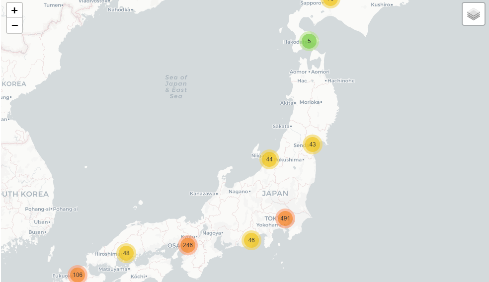

# Recruit Restaurant Visitor Forecasting

This is an exercise to help me understand more about regression, feature engineering, data cleansing and visualization in Python.

## About the Data

In this competition, you're challenged to use reservation and visitation data to predict the total number of visitors to a restaurant for future dates. This is a relational dataset from two systems. Each file is prefaced with the source (either air_ or hpg_) to indicate its origin. Each restaurant has a unique air_store_id and hpg_store_id. Note that not all restaurants are covered by both systems, and that you have been provided data beyond the restaurants for which you must forecast. Latitudes and Longitudes are not exact to discourage de-identification of restaurants. The data contained the following files:

### air_reserve.csv

This file contains reservations made in the air system. Note that the reserve_datetime indicates the time when the reservation was created, whereas the visit_datetime is the time in the future where the visit will occur.

**air_store_id** - the restaurant's id in the air system

**visit_datetime**- the time of the reservation

**reserve_datetime** - the time the reservation was made

**reserve_visitors** - the number of visitors for that reservation

### hpg_reserve.csv

This file contains reservations made in the hpg system.

**hpg_store_id** - the restaurant's id in the hpg system

**visit_datetime** - the time of the reservation

**reserve_datetime** - the time the reservation was made

**reserve_visitors** - the number of visitors for that reservation

### air_store_info.csv

This file contains information about select air restaurants. Column names and contents are self-explanatory.

**air_store_id**

**air_genre_name**

**air_area_name**

**latitude**

**longitude**

Note: latitude and longitude are the latitude and longitude of the area to which the store belongs

### hpg_store_info.csv

This file contains information about select hpg restaurants. Column names and contents are self-explanatory.

**hpg_store_id**

**hpg_genre_name**

**hpg_area_name**

**latitude**

**longitude**

Note: latitude and longitude are the latitude and longitude of the area to which the store belongs

### store_id_relation.csv

This file allows you to join select restaurants that have both the air and hpg system.

**hpg_store_id**
**air_store_id**

### air_visit_data.csv

This file contains historical visit data for the air restaurants.

**air_store_id**

**visit_date** - the date

**visitors** - the number of visitors to the restaurant on the date

#### sample_submission.csv

This file shows a submission in the correct format, including the days for which you must forecast.

**id** - the id is formed by concatenating the air_store_id and visit_date with an underscore

**visitors** - the number of visitors forecasted for the store and date combination

### date_info.csv

This file gives basic information about the calendar dates in the dataset.

**calendar_date**

**day_of_week**

**holiday_flg** - is the day a holiday in Japan

Data and a more detailed description can be found [here](https://www.kaggle.com/c/recruit-restaurant-visitor-forecasting/data):

## About the notebooks

**Analysis.ipynb** - Some visualizations

**Predictions.ipynb** - Code to generate the predictions

## Interesting Findings

- Japanese style is far and away the most popular
- Looks like there is usually a long time between the reservation and visit for "Party" type restaurants. Also the number of people on the reservation is significantly larger than most others.
- It appears that reservations are more common in winter and spring rather than the summer
- Reservations drop off as spring progresses and increase as autumn turns to winter.
- Number of visitors per reservation don't really change much over the seasons
- Friday and Saturday are the most common days for which to make a reservation which is to be expected.
- People appear to reserve during the weekdays and taper off over the weekend.
- Pretty consistent weekly peak-trough pattern for both "Air" and "HPG" datasets.
- Both datsets have a spike around the new year period.
- Big hole in the "Air" data from Aug 2016 to Nov 2016. No immediately identifiable reason for this.
- After this hole there is a significant increase in data points compared to before. Not sure what the trigger is.
- For the "HPG" dataset the weekly peaks significantly increases in the new year of 2017. Was there a marketing campaign that caused this?
- The downturn in both datasets in May 2017 would probably be due to the fact that these datapoints would overlap with the testing dataset.
- Both datasets have a significant climb and precipitous dropoff around the new year period.
- Reservations through these services only provide ~25% of the clientele.

## Interesting Plots

## Libraries used:

- pandas
- numpy
- datetime
- calendar
- geopy
- matplotlib
- seaborn
- folium
- scikit-learn
- XGBoost
- LightGBM
- scipy
